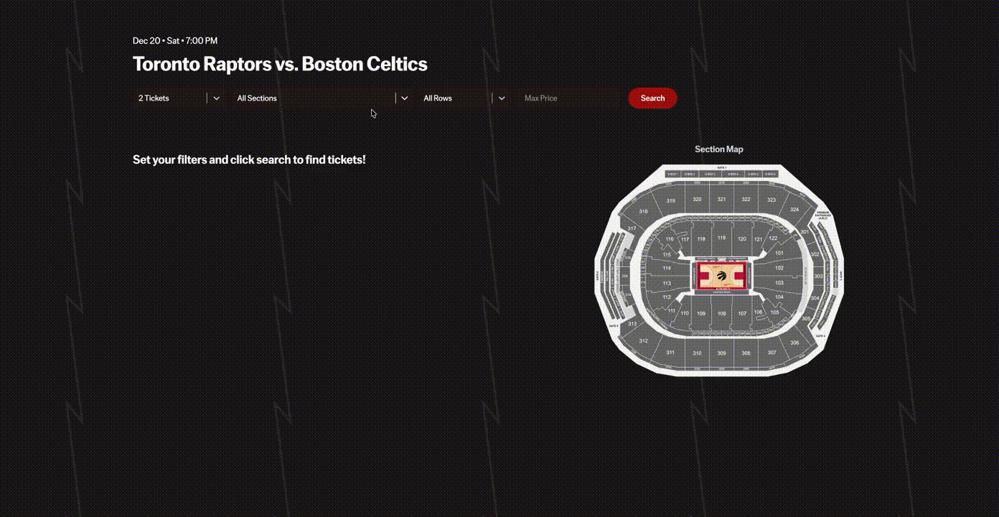
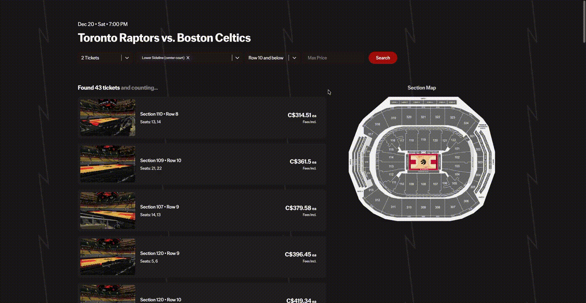

# Raptors Ticket Finder

As a Raptors fan, I was frustrated with searching for tickets on Ticketmaster as their section and price filtering is incredibly tedious, and there is no way to filter by row. Additionally, I didn't want to keep checking Ticketmaster everyday to see if new, cheaper tickets were available.

Therefore, I created the Raptors Ticket Finder, a tool to help Raptors fans monitor Ticketmaster for specific seats at their target price. Users can filter by section, row, and maximum price, and get notified via email when tickets matching their criteria become available.

## Features

- **Data Filtering**: Filter tickets by section, row, price, and number of seats.
- **Web Scraping**: Ticketmaster data extraction, getting header and cookie data using Playwright
- **Database Integration**: All alerts and ticket history are stored in Supabase, preventing duplicate notifications and allowing for tracking over time.
- **Cron Jobs**: Cron-like worker periodically checks for ticket availability and updates the database.
- **Email Notifications**: Sends email notifications when tickets matching user-defined criteria become available.
- **Raptors-Inspired UI**: Designed the website based on the Raptors 2025 City Edition Jerseys.

## Tech Stack

- **Frontend:** React
- **Backend:** Flask (Python)
- **Database:** Supabase (PostgreSQL)
- **Web scraping / API access:** Playwright
- **Email notifications:** Mailgun
- **Background worker:** Python Cron-like function

## How It Works

1. **User Interaction:** Users search for games and set alert criteria through the React frontend.  
2. **API Requests:** Flask endpoints handle ticket queries (`/seats`) and alert creation (`/set-notification`).  
3. **Web Scraping:** Playwright fetches session cookies and headers to query the Ticketmaster API reliably.  
4. **Alert Monitoring:** Background worker periodically queries Ticketmaster, compares new tickets to previously recorded tickets, and triggers email notifications if matching tickets are found.  
5. **Database Storage:** Supabase stores alerts and ticket history to prevent duplicate notifications and maintain state.  
6. **Email Delivery:** Mailgun sends notifications to users when tickets matching their filters appear.